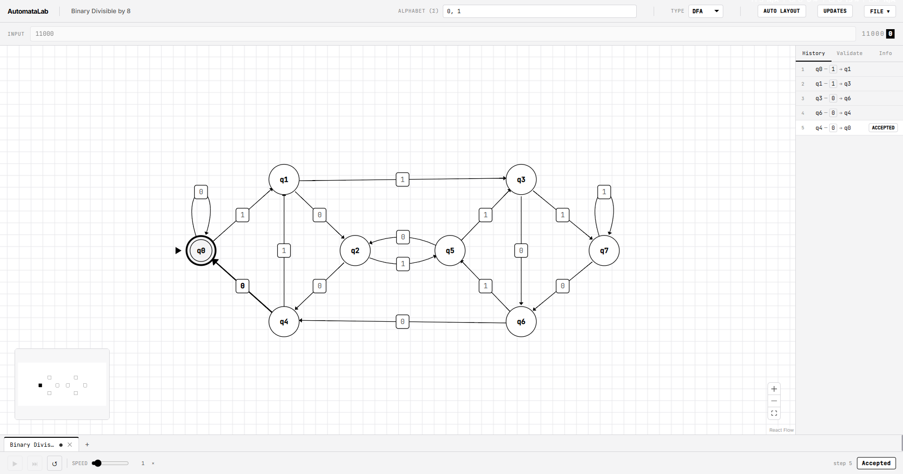

<div align="center">  </div>


<div align="center">
  <h1>AutomataLab</h1>
  <p><strong>A modern, fast, and interactive cross-platform desktop application for designing, simulating, and testing automata across the Chomsky hierarchy, Context-Free Grammars, and formal Parsers.</strong></p>

  <!-- Badges -->
  
  
  
  <br/>
  
  
  
</div>

<br/>

<!-- REPLACE THIS LINK WITH YOUR ACTUAL SCREENSHOT/GIF -->


<br/>

## Download & Install

Ready to build some state machines? Download the latest stable release for your operating system:

**[Download AutomataLab v5.0.0](https://github.com/reeshavsinha/AutomataLab/releases/latest)**

*Auto-updates are fully supported for all platforms.*

---

## Features

AutomataLab features three distinct environments that cover the entire computational curriculum:

### 1. Machine Workspace
- **The Full Chomsky Hierarchy**: Finite automata (DFA, NFA, ε-NFA), Pushdown Automata (DPDA, NPDA), Turing Machines (TM), and Linear-Bounded Automata (LBA).
- **Interactive Canvas**: Seamless drag-and-drop interface for placing states and drawing transitions with auto-layout powered by ELK.
- **Live Simulation & Debugging**: Run step-by-step simulations. Watch the automaton process strings with full visual branching. Explore the Computation Trellis for NFAs or the Exponential Branching Tree for NPDAs.
- **Conversions**: One-click **NFA → DFA** subset construction, **ε-elimination**, **DFA minimization**, and **Regex → NFA** via Thompson's construction.
- **Batch Testing**: Run headless validation of 50+ input strings simultaneously against your machine.

### 2. Grammar Lab
- **Context-Free Grammar Editor**: Write and edit complex context-free grammars with instant validation.
- **Mathematical Diagnostics**: Real-time calculation of **Nullability**, **FIRST sets**, and **FOLLOW sets**. Instantly detects left-recursion and un-factored ambiguity.
- **Grammar Transformations**: Convert any CFG to **Chomsky Normal Form (CNF)** or **Greibach Normal Form (GNF)** with a single click.

### 3. Parser Studio
- **Top-Down Parsers**: Construct predictive **LL(1)** Parse Tables and execute them.
- **Bottom-Up Parsers**: Visualize the exact Shift/Reduce decisions using **LR(0)**, **SLR(1)**, **LALR(1)**, or **CLR(1)** item sets. Automatically visualizes the underlying Item Set DFA.
- **General Parsing**: Parse *any* grammar—no matter how ambiguous—using the **CYK** dynamic programming algorithm or the highly robust **Earley** chart parser.
- **Abstract Syntax Trees (AST)**: Step-by-step interactive derivation tree builder during parser simulation.

For more detailed documentation, including file formats and mathematical schemas, please check out our **[Project Wiki](https://github.com/reeshavsinha/AutomataLab/wiki)**.

---

## Keyboard Shortcuts

| Shortcut | Action |
| :--- | :--- |
| `Space` or `P` | Play / Pause Simulation |
| `Right Arrow` or `S` | Step Forward Simulation |
| `Left Arrow` | Step Back Simulation |
| `R` | Reset Simulation |
| `N` | Add a state at the viewport centre |
| `I` / `F` | Set selected state as **Start** / toggle **Accept** |
| `Ctrl + Z` / `Ctrl + Y` | Undo / Redo |
| `Ctrl + Click` / `Shift + Drag` | Add to selection / rubber-band select an area |
| `Ctrl + C` / `V` / `X` | Copy / Paste / Cut |
| `Ctrl/Cmd + N` / `O` / `S` / `Shift + S` | New / Open / Save / Save As |

---

## Development

Want to build it from source?

```bash
# Install dependencies
npm install

# Run the Tauri development app
npm run tauri:dev
```

## License
This project is licensed under the [MIT License](LICENSE).
