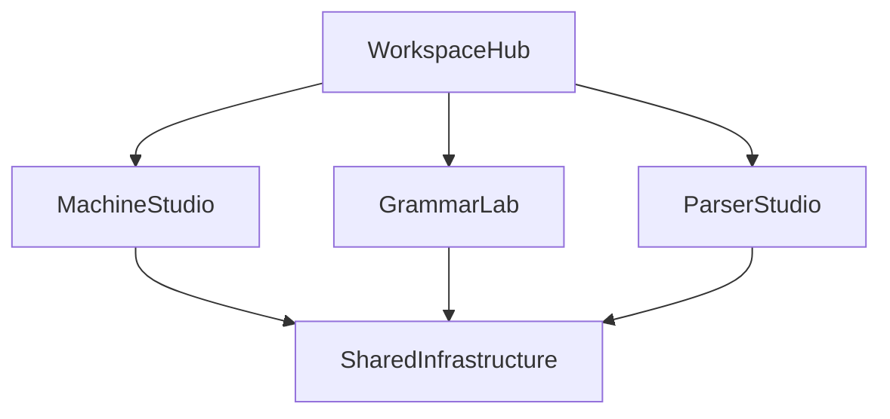

# AutomataLab Revised Parity Implementation Plan

> **INTERNAL / DO NOT COMMIT.** Revised implementation plan based on the parity gap analysis and the subsequent priority review.
>
> **Status:** Phases A1–A4 and C1–C4 are implemented in the current working tree. Phases B and D remain intentionally skipped.
>
> **Baseline:** Current manifests report AutomataLab 5.0.0. The working tree includes Machine Studio, Grammar Lab, Parser Studio, Workspace Hub, User Manual, Theory Handbook, JFLAP interoperability, the Phase 0 foundation, and Phase C.
>
> **Last updated:** 2026-09-05

---

## 1. Strategic Objective

The goal is not literal feature duplication with JFLAP, Turing's World, VAS, TAGS, or SimStudio. The goal is to make AutomataLab a stronger environment for:

- constructing formal models;
- executing them deterministically and safely;
- understanding intermediate algorithmic steps;
- testing models against explicit oracles;
- producing inspectable academic artifacts; and
- connecting Theory of Computation with Compiler Design.

Correctness, pedagogical value, reproducibility, and integration take priority over decorative parity.

---

## 2. Workspace Placement

Parity work extends the three implemented workspaces. The proposed fourth
Formal Systems Lab was skipped with Phases B and D.



### Machine Studio

- Mealy and Moore machines
- Mealy/Moore conversions
- Turing-machine breakpoints and watchers
- Multi-track single-tape TMs
- Hierarchical TM submachines
- Machine-side batch execution
- Keyboard-first canvas editing

### Grammar Lab

- Type-0 and Type-1 grammar representations
- Grammar classification
- Bounded derivation and sentence search
- CFG-only grammar-side ambiguity analysis

### Parser Studio

- Parser-side batch execution (implemented)
- CYK parsing and visualization (implemented; the Phase B interactive exercise
  layer was skipped)
- Manual parse-tree construction (skipped with Phase B)
- Interactive NFA-to-DFA conversion exercises (skipped with Phase B)
- Parse-tree ambiguity comparison exercise (skipped with Phase B)

### Formal Systems Lab (skipped)

The fourth workspace is not planned in the current delivery direction. The previously proposed modules are retained only as historical Phase B/D notes:

- Pumping Lemma exercises
- L-System rewriting and Turtle Graphics

Future closure-property and reduction exercises may also be placed here. The User Manual and Theory Handbook remain documentation surfaces, not workspace replacements.

### Shared Infrastructure

- Unified batch test-suite model
- Configuration/trace matrix export
- File-format and migration support
- Worker execution and cancellation
- Keyboard command routing
- Optional visual effects
- Accessibility and reduced-motion preferences

---

## 3. Revised Priority Matrix

| Feature | Priority | Destination | Decision |
| :--- | :--- | :--- | :--- |
| Mealy and Moore machines | P0 | Machine Studio | Implemented in Phase A1 |
| Batch Test Oracle | P0/P1 | Shared, Machine, Parser | Implemented in Phase A2 |
| Configuration Matrix Export | P2, low cost | Shared panels | Implemented in Phase A3 |
| Keyboard-first editing | P2, low cost | Machine Studio/shared commands | Implemented in Phase A4 |
| Interactive NFA-to-DFA conversion | P1 | Conversion education flow | Skipped (Phase B) |
| Interactive CYK | P1 | Parser Studio | Skipped (Phase B) |
| Manual Parse Tree Builder | P1 | Parser Studio | Skipped (Phase B) |
| Pumping Lemma Game | P1 | Formal Systems Lab | Skipped (Phase B) |
| Ambiguity Diff Inspector | P2 | Parser Studio/Grammar Lab | Skipped (Phase B) |
| TM Breakpoints and Watchers | P1 | Machine Studio | Implemented in Phase C2 |
| Multi-track TM | P1/P2 | Machine Studio | Implemented in Phase C3 |
| Type-1 and Type-0 grammars | P2 | Grammar Lab | Implemented in Phase C1 with bounded-result semantics |
| Hierarchical TM submachines | P2 | Machine Studio | Implemented in Phase C4 as an advanced mode |
| L-Systems | P3 | Formal Systems Lab | Skipped (Phase D) |
| Live dual-canvas subset construction | P3 | Conversion education flow | Skipped (Phase D) |
| Particle animation | P3 | Shared Machine Studio UI | Skipped (Phase D) |
| Audio cues | P3 | Shared UI | Skipped (Phase D) |

---

## 4. Phase A — Core Completeness

Phase A strengthens the underlying platform before adding advanced educational exercises.

### A1. Mealy and Moore Machines

Add output-producing finite-state models beside the existing acceptor models.

Implementation scope:

- Extend the machine type and capability contracts with `MEALY` and `MOORE`.
- Add output-alphabet support.
- Add transition outputs for Mealy machines.
- Add state outputs for Moore machines.
- Add output-aware configurations, step results, history, and batch results.
- Add Machine Studio editors and output trace panels.
- Add Moore-to-Mealy and Mealy-to-Moore conversions.
- Define and test initial-output semantics explicitly.
- Update validation, copy/paste, file loading, JSON export, diagram export, and JFLAP support where the format permits it.

Acceptance criteria:

- A transducer can be edited, saved, reopened, and simulated.
- Output traces are deterministic and replayable.
- Conversion tests compare output behavior over bounded input suites.
- Existing recognizer machines remain behaviorally unchanged.

Implementation status (2026-08-25):

- `MEALY` and `MOORE` are registered as graph-backed machine types with output alphabets.
- `TransducerEngine` provides deterministic Mealy transition output and Moore initial/destination-state output semantics.
- Machine Studio includes output-aware toolbar configuration, transition/state editors, clipboard handling, output traces, batch result traces, and native JSON round trips.
- Moore → Mealy and Mealy → Moore conversions are registered and covered by bounded behavior tests. JFLAP export is disabled for transducers because standard JFLAP FA XML has no lossless output representation.

Implementation status (2026-08-25, A2–A4):

- A2 is implemented through `utils/testSuite.ts` and fresh parser adapters: shared text/CSV/JSON suites, expected verdict/output/tape/trace checks, visible/hidden/random/boundary categories, limit/error/mismatch scoring, deterministic reports, and first-counterexample reporting.
- A3 is implemented through enriched machine history and model-aware configuration matrix CSV/Markdown/LaTeX exports, including independent multi-tape columns.
- A4 is implemented through the command metadata registry, cursor-positioned state creation, keyboard transition commands, context-sensitive `S` precedence, and input/editor/dialog suppression.
- Mealy/Moore machines are output-only transducers: final-state controls and accept/reject language semantics are disabled, and completed runs report `completed` with `accepted: null`.

### A2. Unified Batch Test Oracle

The existing machine batch runner and Parser Studio batch flow should be unified behind a reusable test-suite model.

The model should support:

- input;
- expected accept/reject verdict;
- expected transducer output;
- expected tape or trace properties;
- actual result;
- pass/fail/error classification;
- step count;
- resource-limit status; and
- test category.

Test categories should support:

- visible tests;
- hidden tests stored locally or supplied by an instructor workflow;
- deterministic random tests; and
- boundary tests.

Implementation scope:

- Extract parsing, execution, comparison, scoring, and reporting from UI components.
- Preserve the current line-oriented `.txt` format.
- Add validated CSV and JSON formats.
- Add parser and transducer execution adapters.
- Prevent parser batch runs from corrupting the interactive Parser Studio session.
- Add counterexample identification for the first failing case.
- Keep report generation deterministic and make Markdown, CSV, and LaTeX outputs the initial report targets.
- Defer PDF generation until the report model is stable.

Acceptance criteria:

- One suite model can test a machine, parser, or transducer.
- Expected verdict/output/tape mismatches are clearly distinguished.
- A failing suite identifies a reproducible counterexample.
- Large suites run under visible limits and do not freeze the UI.

### A3. Configuration Matrix and Trace Export

Extend the existing history and trace data into an academic export surface:

```text
Step | State | Input position | Consumed input | Stack | Tape | Output | Status
```

Export targets:

- CSV for data processing;
- Markdown for documentation;
- LaTeX tables for assignments and papers.

The exporter must omit columns that do not apply to a model and must preserve the distinction between independent multi-tape machines and future multi-track tapes.

### A4. Keyboard-First Editing

Extend the current keyboard hooks and command bus without creating shortcut conflicts.

Required behavior:

- Create a state at the current canvas cursor position.
- Start and complete transition creation using keyboard commands.
- Retain existing simulation shortcuts.
- Suppress editing shortcuts in inputs, editors, dialogs, and content-editable elements.
- Ensure `S` does not conflict with the existing simulation-step behavior; context and focus must determine which action is active.
- Make all shortcuts discoverable through the User Manual and accessible command labels.

---

## 5. Phase B — Educational Superpowers (Skipped)

Phase B is intentionally out of scope for the current product direction. The detailed items below are retained as historical design notes only.

<!-- Phase B — historical design notes

Phase B focuses on features that show how an answer is obtained, not merely the final answer.

### B1. Interactive NFA-to-DFA Conversion

Add an educational construction mode to the existing conversion flow.

Student workflow:

1. inspect the current NFA state set;
2. construct a DFA subset state;
3. calculate transitions for each input symbol;
4. mark accepting subsets;
5. request a hint or validate the current step; and
6. compare the student construction with the authoritative subset construction.

The exercise state must remain separate from the production conversion result. The existing conversion engine remains the correctness oracle.

### B2. Interactive CYK

Extend the current automated CYK table with an exercise mode:

- display the lower-triangular table;
- allow candidate nonterminals to be entered per cell;
- validate terminal and binary-production cases;
- show all valid split points;
- highlight dependencies;
- provide hints;
- support reset and retry; and
- distinguish an empty cell from an uncompleted cell.

The existing automatic CYK simulation must remain authoritative and must not be mutated by exercise attempts.

CYK suitability, CNF conversion, epsilon handling, input-token limits, and resource limits must be visible to the user.

### B3. Manual Parse Tree Builder

Add a student-driven parse-tree mode in Parser Studio:

- start from the grammar start symbol;
- expand a selected nonterminal using one production;
- support leftmost and rightmost derivation views;
- show the current sentential form;
- validate terminal leaves against the input;
- report incomplete, invalid, and complete trees; and
- allow comparison with automatically generated trees.

The tree model should be shared with the ambiguity-diff feature, but manual attempts must remain independent from automatic parser state.

### B4. Pumping Lemma Game

Create the first Formal Systems Lab module around a pure, bounded exercise engine.

The interaction may follow:

1. opponent supplies a pumping length \(m\);
2. prover selects a witness \(w\) with \(|w| \ge m\);
3. opponent selects a legal decomposition;
4. prover selects a pumping value \(i\); and
5. the resulting string is checked against the language predicate.

#### Quantifier correctness requirement

The engine must not conclude that a language is non-regular merely because one selected decomposition fails. The regular pumping lemma has the relevant quantifier structure:

- the adversary may choose any valid decomposition;
- a successful non-regularity argument must defeat every legal decomposition for the selected witness and pumping length;
- one failed decomposition demonstrates only that decomposition, not the complete proof.

For context-free pumping exercises, the same principle applies to the five-part decomposition and its legal constraints.

Therefore the implementation must:

- model all legal decompositions within the configured bound;
- show whether the current result is a single-play result or an exhaustive bounded result;
- never label a bounded search as a general mathematical proof without a proof certificate;
- provide `FOUND`, `NOT_FOUND_WITHIN_LIMIT`, and `RESOURCE_LIMIT`-style outcomes where exhaustive search is incomplete; and
- use only language predicates and presets that have been mathematically reviewed.

### B5. Ambiguity Diff Inspector

Use the existing bounded ambiguity search and parse-tree models to render two derivations side by side.

The inspector should:

- align corresponding tree regions where possible;
- highlight the first structural divergence;
- identify the productions responsible for each divergence;
- retain the input sentence and grammar context; and
- state that bounded search found two derivations rather than claiming global ambiguity from an incomplete search. -->

---

## 6. Phase C — Advanced Theory and Computation (Implemented)

Implementation evidence:

- C1: `engines/grammar/{parser,types,classification,derivationSearch,derivationWorker}.ts`
- C2: `engines/machine/tm/watchers.ts`, `store/tmDebugStore.ts`, and `components/panels/WatchersPanel.tsx`
- C3: `engines/machine/multitrack/MultiTrackTMEngine.ts` with the `MTM` type and track-aware editor/panel fields
- C4: `engines/machine/hierarchical/HierarchicalTMEngine.ts`, embedded `MachineDefinition.submachines`, and `SubmachinesPanel.tsx`

The requirements below are retained as the acceptance contract. Automated
engine/integration tests exist for each area. Browser-level coverage remains a
follow-up, and the NLBA computation-tree UI has a separate known capability-
helper drift documented in `handoff.md`.

### C1. Type-1 and Type-0 Grammars

Extend the grammar domain without weakening CFG parser assumptions.

Required capabilities:

- multi-symbol left-hand sides;
- arbitrary nonempty left-hand sides for unrestricted rules;
- non-contracting-rule validation;
- Chomsky hierarchy classification;
- bounded breadth-first derivation;
- duplicate sentential-form elimination;
- provenance for every rewrite;
- sentential-form length, depth, node, and time limits;
- worker execution and cancellation; and
- explicit result statuses:
  - `FOUND`;
  - `NOT_FOUND_WITHIN_LIMIT`;
  - `RESOURCE_LIMIT`;
  - `CANCELLED`.

The UI must never imply that Type-0 membership has been decided merely because a bounded search did not find a derivation.

### C2. TM Breakpoints and Watchers

Add conditional pause predicates to Machine Studio:

- current state;
- symbol under one or more heads;
- absolute head position;
- step number;
- tape contents within a window; and
- combinations using AND/OR conditions.

Requirements:

- breakpoints are UI/debugging state, not machine-definition semantics;
- automatic execution pauses before the next step when the condition is met;
- manual Step Forward intentionally bypasses watchers;
- step-back and seek/replay preserve breakpoint determinism;
- conditions are validated and visibly summarized; and
- breakpoints work with existing single- and multi-tape TMs.

### C3. Multi-track Single-tape TMs

Keep this distinct from the existing multi-tape implementation:

- one physical tape;
- one head;
- vector-valued cells;
- a configurable number of tracks.

Define:

- track alphabet and blank semantics;
- read/write matching;
- track rendering;
- editing behavior;
- history snapshots;
- loop-detection identity;
- serialization migration; and
- export limitations.

Acceptance tests must prove that multi-track execution is not accidentally treated as independent multi-tape execution.

### C4. Hierarchical TM Submachines

Implement only after TM traces, breakpoints, and persistence are stable.

Required design decisions:

- explicit child-machine ownership or references;
- entry and return contracts;
- accept, reject, stuck, and step-limit propagation;
- nested call-stack representation;
- recursion and depth limits;
- cycle detection;
- deterministic replay and seek;
- child-definition serialization; and
- missing-reference recovery.

This should initially be an advanced mode, not a default Machine Studio workflow.

---

## 7. Phase D — Optional and Showcase Features (Skipped)

Phase D is intentionally skipped. No Formal Systems Lab, L-System, dual-canvas showcase, particle, or audio work is scheduled from this plan.

<!-- Phase D — historical design notes

### D1. L-Systems

Add L-Systems only after the core educational features are stable.

Scope:

- axiom and production-rule editor;
- parallel rewriting;
- step and recursion-depth controls;
- output-size budgets;
- deterministic and optional stochastic rules;
- Turtle Graphics rendering;
- pan/zoom;
- SVG export; and
- worker execution for large rewrites.

This belongs in Formal Systems Lab because it is a rewriting/visualization system rather than a recognizer, grammar parser, or compiler parser.

### D2. Live Dual-canvas Subset Construction

Add as a showcase enhancement:

- NFA source view;
- DFA subset view;
- synchronized state and transition highlighting;
- correspondence inspection; and
- educational validation hooks.

The authoritative subset-construction engine must remain independent of the visualization.

### D3. Particle Animation

Add only as optional visual polish:

- animate pulses along active transition paths;
- account for grouped visual edges and member transitions;
- stop effects on pause, reset, tab switch, and terminal states;
- support reduced-motion preferences; and
- avoid making animation part of simulation correctness.

### D4. Audio

Audio is explicitly deferred and is not a required parity feature.

It may be reconsidered only if a concrete accessibility or educational requirement is established. If eventually implemented, it must be:

- opt-in;
- disabled by default;
- unlocked only after user interaction;
- unavailable without throwing when Web Audio is unsupported; and
- completely independent of engine state and test outcomes. -->

---

## 8. Cross-cutting Engineering Rules

### Engine/UI separation

All formal algorithms remain pure TypeScript and must not import React, DOM APIs, or browser-only services. UI components consume engine results and manage presentation state.

### Determinism

The same definition, input, exercise actions, and limits must produce the same result ordering, trace, and report. Random tests must use explicit seeds.

### Resource budgets

Potentially unbounded or exponential work must have:

- maximum steps;
- maximum nodes or frontier size;
- maximum output/sentential-form length;
- cancellation;
- visible resource-limit results; and
- worker execution where the operation can block the interface.

### Persistence

Every new persisted field requires:

- an explicit schema;
- a version;
- backward-compatible loading;
- rejection or migration of unsupported future major versions;
- sanitization at the file boundary; and
- round-trip tests.

### Education state isolation

Exercise attempts, hints, and grading state must not mutate the authoritative machine, grammar, parser, or simulation state.

### Accessibility

Every educational interaction must provide:

- keyboard access;
- visible focus;
- non-color status indicators;
- readable error and limit messages;
- reduced-motion behavior where animation exists; and
- a non-audio equivalent for every meaningful result.

---

## 9. Verification Plan

Each feature must include:

- pure engine unit tests;
- boundary and resource-limit tests;
- serialization round-trip tests;
- deterministic replay tests;
- UI integration tests;
- malformed-input tests where files are involved; and
- at least one end-to-end workflow.

Required end-to-end workflows include:

1. Create, simulate, batch-test, export, save, reopen, and replay a Mealy machine.
2. Create and simulate a Moore machine, including its initial output and output trace.
3. Run bounded Type-0/Type-1 derivation and distinguish `NOT_FOUND_WITHIN_LIMIT` from `RESOURCE_LIMIT`.
4. Set a TM watcher, pause on a matching condition, step back, and replay.
5. Execute a multi-track TM and verify one-head vector-cell semantics.

Release gates:

- `npm test`
- `npx tsc --noEmit`
- `npm run build`
- accessibility checks for new UI
- performance checks for worker-backed operations
- no regression in existing Machine, Grammar, Parser, and file workflows

The previous Phase A verification baseline was **42 test files and 530 passing
tests**. The current working tree is verified at **58 test files and 645 passing
tests**; standard and demo-mode production builds pass. Existing Vite
chunk-size and mixed static/dynamic-import warnings remain non-blocking.

---

## 10. Recommended Delivery Order

### Phase A

1. Mealy and Moore machines
2. Unified Batch Test Oracle
3. Configuration Matrix Export
4. Keyboard-first editing

### Phase C (completed in the current working tree)

5. Type-1 grammar support
6. Type-0 grammar support
7. TM Breakpoints and Watchers
8. Multi-track TMs
9. Hierarchical TM submachines

### Phases B and D

Skipped by product decision; they are not part of the active delivery order.

This ordering prioritizes missing theoretical models, reusable testing infrastructure, explanation-oriented learning, and practical debugging before optional visual or sensory polish.
