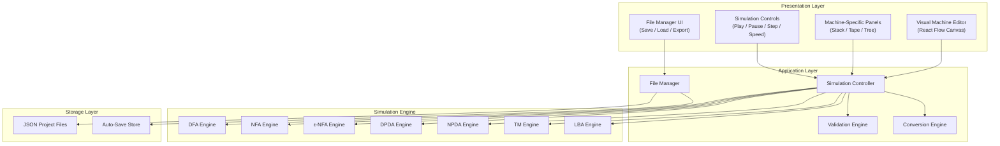
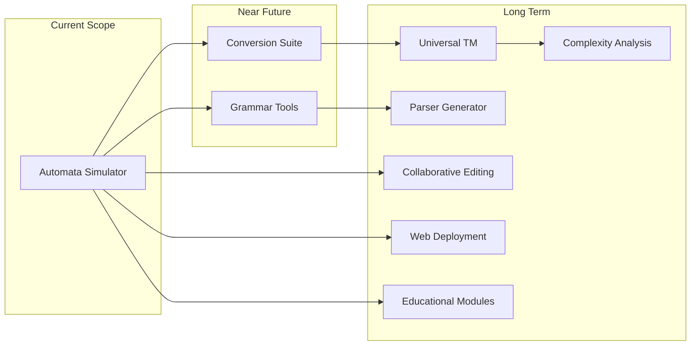

# AutomataLab — Product Requirements Document

> **Version:** 1.0  
> **Last Updated:** June 6, 2026  
> **Status:** Draft  
> **Author:** AutomataLab Team

---

## Table of Contents

1. [Vision](#vision)
2. [Problem Statement](#problem-statement)
3. [Target Users](#target-users)
4. [Product Goals](#product-goals)
5. [Core Features](#core-features)
6. [User Stories](#user-stories)
7. [Functional Requirements](#functional-requirements)
8. [Non-Functional Requirements](#non-functional-requirements)
9. [MVP Scope & Release Plan](#mvp-scope--release-plan)
10. [Architecture Overview](#architecture-overview)
11. [Technology Stack](#technology-stack)
12. [Competitive Analysis](#competitive-analysis)
13. [Success Metrics](#success-metrics)
14. [Risks & Mitigations](#risks--mitigations)
15. [Long-Term Vision](#long-term-vision)

---

## Vision

AutomataLab aims to become the most comprehensive visual learning and simulation environment for computational models spanning the entire **Chomsky hierarchy**.

Students should be able to **design** a machine, **execute** it visually, **inspect** every computational step, and **understand** theoretical concepts through interactive, real-time visualizations — all without writing a single line of code.

---

## Problem Statement

Existing automata simulators suffer from one or more critical limitations:

| Problem | Impact |
|---|---|
| Support only a single machine type (e.g., DFA only) | Students must use multiple fragmented tools |
| Poor or no visualization | Abstract concepts remain abstract |
| No computation-tree rendering for nondeterminism | NFA/NPDA behavior is invisible |
| Outdated UI with no drag-and-drop | Steep learning curve, poor engagement |
| Lack of educational tooling (step-by-step, speed control) | Cannot be used effectively in classrooms |
| No conversion utilities (NFA→DFA, Regex→NFA) | Misses key curriculum topics |
| Limited extensibility | Adding new machine types requires rewrites |

AutomataLab addresses **all** of these through a unified, modern simulation platform.

---

## Target Users

### Primary Users

| Persona | Description | Key Needs |
|---|---|---|
| **CS Undergraduate** | Taking Theory of Computation, Compiler Design, or Formal Languages courses | Visual learning, step-by-step execution, quick machine creation |
| **Instructor / Professor** | Teaching automata theory in a university setting | Live classroom demos, save/share machines, clear visual output |

### Secondary Users

| Persona | Description | Key Needs |
|---|---|---|
| **Graduate Researcher** | Exploring automata properties or designing new models | Execution trace export, machine validation, extensibility |
| **Self-Learner** | Studying CS theory independently | Intuitive UI, no documentation dependency, educational hints |
| **Competitive Programmer** | Practicing formal language problems | Fast machine creation, batch input testing |

---

## Product Goals

| # | Goal | Success Indicator |
|---|---|---|
| G1 | Provide a complete visual environment for **all major computational models** (DFA, NFA, ε-NFA, DPDA, NPDA, LBA, TM) | All 7 machine types are creatable and simulatable |
| G2 | Enable **interactive learning** through animation and visualization | Users can step through execution and observe every state change |
| G3 | Offer a **reusable, extensible architecture** for future machine types | Adding a new machine type requires only engine + panel, no UI rewrite |
| G4 | Become suitable for **classroom demonstrations** and self-paced learning | Instructors can demo in < 2 minutes; students can self-serve |
| G5 | Deliver a **polished, modern desktop application** | Cross-platform (Windows, macOS, Linux), responsive, visually appealing |

---

## Core Features

### 1. Visual Machine Editor

The centerpiece of AutomataLab. A drag-and-drop canvas where users build automata graphically.

**Capabilities:**

- Add, delete, rename, and reposition states
- Mark **start**, **accept**, and **reject** (TM) states
- Create transitions by dragging between states
- Edit transition labels inline
- Create self-loops
- Support multiple transitions between the same state pair
- Zoom, pan, and fit-to-view controls
- Undo / Redo (Ctrl+Z / Ctrl+Y)
- Grid snapping (optional)
- Minimap for large machines

### 2. Live Simulation Engine

Step-by-step or continuous execution with real-time visual feedback.

**Capabilities:**

- Enter input strings via an input bar
- **Play** — continuous execution at configurable speed
- **Pause** — freeze the current configuration
- **Step Forward** — advance one transition
- **Stop / Reset** — return to initial configuration
- **Speed Slider** — control animation speed (0.25x to 8x)
- Highlight the **current active state(s)** during execution
- Animate transitions as they fire
- Display **consumed input**, **current symbol**, and **remaining input**
- Show **Accept / Reject / Running** status badge

### 3. Machine-Specific Visualization Panels

Each machine type has a dedicated panel for its unique data structures.

#### DFA / NFA / ε-NFA Panel

- Current state set (NFA: multiple states highlighted simultaneously)
- Input tape with read-head indicator
- Transition history log

#### PDA Panel (DPDA / NPDA)

- **Stack visualizer** — vertical stack with animated push/pop
- Stack-top indicator
- Instantaneous Description (ID) display
- Transition format: `(state, input, stack_top) → (state', push_string)`

#### Turing Machine / LBA Panel

- **Infinite tape widget** — scrollable tape with cells
- **Tape head** — highlighted current cell with direction arrows
- Read / Write / Move animation
- Current state label on head
- LBA: visible **left and right boundary markers**

### 4. Computation Tree Viewer

> [!IMPORTANT]
> This is the key differentiator from most existing simulators.

For **nondeterministic** machines (NFA, ε-NFA, NPDA):

- Render a **tree** of all computation branches
- Color-code branches: 🟢 Accepted, 🔴 Rejected, 🟡 Running
- Allow users to click a branch to inspect its configuration
- Collapse/expand subtrees
- Display branch depth and total branches explored

### 5. Conversion Utilities

| Conversion | Direction |
|---|---|
| ε-NFA → NFA | Epsilon elimination |
| NFA → DFA | Subset construction |
| DFA → Minimized DFA | State minimization (Hopcroft's algorithm) |
| Regex → NFA | Thompson's construction |
| CFG → PDA | Grammar-to-pushdown conversion |

Each conversion should be **animated step-by-step** with before/after views.

### 6. Project Save System

- **Save / Load** machine definitions as `.autolab.json` files
- **Export** machine as:
  - JSON
  - PNG (canvas screenshot)
  - SVG (vector export)
- **Import** from JSON
- Recent files list
- Auto-save with recovery

### 7. Machine Validation

Before execution, validate:

- Exactly one start state exists
- Transitions are well-formed for the machine type
- DFA: deterministic (one transition per symbol per state)
- LBA: tape head stays within bounds
- Reachability warnings (unreachable states)
- Display validation errors/warnings in a panel

---

## User Stories

### Student

> *As a CS student, I want to **visually create a DFA** by dragging states and connecting them with transitions, so that I can verify my homework solutions without manual trace tables.*

> *As a student studying nondeterminism, I want to **see all computation branches of an NFA** simultaneously, so that I can understand why a string is accepted even when some branches reject.*

> *As a student, I want to **watch a Turing Machine's tape head move** cell by cell, so that I can understand how TMs compute functions.*

### Instructor

> *As an instructor, I want to **demonstrate NFA→DFA conversion step-by-step** in a lecture, so that students can follow the subset construction algorithm visually.*

> *As an instructor, I want to **save and share machine definitions** with my class, so that students can load and experiment with them.*

> *As an instructor, I want to **control simulation speed** so that I can slow down execution for explanations and speed it up for complex inputs.*

### Researcher

> *As a researcher, I want to **export execution traces** so that I can analyze machine behavior programmatically.*

> *As a researcher, I want to **test multiple input strings** against a machine and see batch results, so that I can validate language membership efficiently.*

---

## Functional Requirements

### FR-1: Machine Creation

| ID | Requirement | Priority |
|---|---|---|
| FR-1.1 | Create DFA | P0 |
| FR-1.2 | Create NFA | P0 |
| FR-1.3 | Create ε-NFA | P0 |
| FR-1.4 | Create DPDA | P1 |
| FR-1.5 | Create NPDA | P1 |
| FR-1.6 | Create LBA | P2 |
| FR-1.7 | Create TM | P1 |

### FR-2: State Management

| ID | Requirement | Priority |
|---|---|---|
| FR-2.1 | Create states via click/drag | P0 |
| FR-2.2 | Delete states | P0 |
| FR-2.3 | Rename states | P0 |
| FR-2.4 | Move states (drag) | P0 |
| FR-2.5 | Mark start state (exactly one) | P0 |
| FR-2.6 | Mark accept state(s) | P0 |
| FR-2.7 | Mark reject state (TM only) | P1 |

### FR-3: Transition Management

| ID | Requirement | Priority |
|---|---|---|
| FR-3.1 | Create transitions by dragging between states | P0 |
| FR-3.2 | Edit transition labels | P0 |
| FR-3.3 | Delete transitions | P0 |
| FR-3.4 | Self-loop transitions | P0 |
| FR-3.5 | Multiple transitions between same state pair | P0 |
| FR-3.6 | PDA transition format: `(read, pop → push)` | P1 |
| FR-3.7 | TM transition format: `(read → write, direction)` | P1 |

### FR-4: Simulation Execution

| ID | Requirement | Priority |
|---|---|---|
| FR-4.1 | Enter input string | P0 |
| FR-4.2 | Run simulation (continuous) | P0 |
| FR-4.3 | Step-by-step execution | P0 |
| FR-4.4 | Pause / Resume | P0 |
| FR-4.5 | Reset simulation | P0 |
| FR-4.6 | Speed control slider | P0 |
| FR-4.7 | Batch input testing | P2 |

### FR-5: Visualization

| ID | Requirement | Priority |
|---|---|---|
| FR-5.1 | Highlight active state(s) | P0 |
| FR-5.2 | Animate transitions | P0 |
| FR-5.3 | Show consumed / remaining input | P0 |
| FR-5.4 | Stack visualization (PDA) | P1 |
| FR-5.5 | Tape + head visualization (TM/LBA) | P1 |
| FR-5.6 | Computation tree (NFA/NPDA) | P1 |
| FR-5.7 | Execution history log | P0 |

### FR-6: File Operations

| ID | Requirement | Priority |
|---|---|---|
| FR-6.1 | Save machine to JSON | P0 |
| FR-6.2 | Load machine from JSON | P0 |
| FR-6.3 | Export canvas as PNG/SVG | P2 |
| FR-6.4 | Auto-save with recovery | P2 |

### FR-7: Conversion Utilities

| ID | Requirement | Priority |
|---|---|---|
| FR-7.1 | ε-NFA → NFA | P2 |
| FR-7.2 | NFA → DFA (subset construction) | P2 |
| FR-7.3 | DFA minimization | P2 |
| FR-7.4 | Regex → NFA | P3 |
| FR-7.5 | CFG → PDA | P3 |

### FR-8: Validation

| ID | Requirement | Priority |
|---|---|---|
| FR-8.1 | Validate single start state | P0 |
| FR-8.2 | Validate transition completeness | P0 |
| FR-8.3 | DFA determinism check | P0 |
| FR-8.4 | Unreachable state warnings | P1 |
| FR-8.5 | LBA boundary validation | P2 |

---

## Non-Functional Requirements

### Performance

| ID | Requirement | Target |
|---|---|---|
| NFR-1 | Simulation step latency | < 50ms |
| NFR-2 | UI interaction response time | < 100ms |
| NFR-3 | Canvas render at 500 states | 60 FPS |
| NFR-4 | File save/load for large machines | < 2 seconds |
| NFR-5 | Application cold start | < 3 seconds |

### Reliability

| ID | Requirement |
|---|---|
| NFR-6 | Save/load operations preserve full machine integrity |
| NFR-7 | Invalid machines are detected before simulation starts |
| NFR-8 | Application gracefully handles infinite loops in TMs (configurable step limit) |
| NFR-9 | Crash-free session rate > 99% |

### Usability

| ID | Requirement |
|---|---|
| NFR-10 | Drag-and-drop for all machine construction operations |
| NFR-11 | Keyboard shortcuts for common actions |
| NFR-12 | Learnable without external documentation |
| NFR-13 | Consistent UI patterns across all machine types |
| NFR-14 | Dark mode and light mode support |

### Maintainability

| ID | Requirement |
|---|---|
| NFR-15 | Simulation engine fully decoupled from UI layer |
| NFR-16 | All machine types implement a common `Automaton` interface |
| NFR-17 | Unit test coverage ≥ 80% for simulation engines |
| NFR-18 | Each machine engine is independently testable |

### Portability

| ID | Requirement |
|---|---|
| NFR-19 | Runs on Windows 10+, macOS 12+, Ubuntu 20.04+ |
| NFR-20 | Consistent behavior across all supported platforms |

### Scalability

| ID | Requirement |
|---|---|
| NFR-21 | Support ≥ 500 states per machine |
| NFR-22 | Support ≥ 2,000 transitions per machine |
| NFR-23 | NFA computation tree depth ≥ 100 levels |

---

## MVP Scope & Release Plan

### Version 1.0 — Foundation (MVP)

> **Target:** Core DFA/NFA experience with visual editor and live simulation.

| Feature | Included |
|---|---|
| DFA creation & simulation | ✅ |
| NFA creation & simulation | ✅ |
| ε-NFA creation & simulation | ✅ |
| Visual drag-and-drop editor | ✅ |
| Step-by-step execution | ✅ |
| Continuous execution with speed control | ✅ |
| Active state highlighting | ✅ |
| Transition animation | ✅ |
| Input bar with consumed/remaining display | ✅ |
| Save/Load (JSON) | ✅ |
| Machine validation | ✅ |
| Execution history log | ✅ |
| PDA / TM / LBA | ❌ |
| Conversion utilities | ❌ |
| Computation tree | ❌ |

---

### Version 2.0 — Pushdown Automata

> **Target:** Full PDA support with stack visualization and computation trees.

| Feature | Included |
|---|---|
| DPDA creation & simulation | ✅ |
| NPDA creation & simulation | ✅ |
| Stack visualization panel | ✅ |
| Push/pop animations | ✅ |
| Computation tree viewer (NFA + NPDA) | ✅ |
| Instantaneous description display | ✅ |

---

### Version 3.0 — Turing Machines & LBA

> **Target:** Complete Chomsky hierarchy coverage.

| Feature | Included |
|---|---|
| Turing Machine creation & simulation | ✅ |
| LBA creation & simulation | ✅ |
| Infinite tape widget | ✅ |
| Tape head animation | ✅ |
| LBA boundary enforcement | ✅ |
| Multi-tape TM support | ✅ |
| Configurable step limit (infinite loop protection) | ✅ |

---

### Version 4.0 — Conversions & Advanced Tools

> **Target:** Conversion utilities, educational tools, and polish.

| Feature | Included |
|---|---|
| NFA → DFA conversion (animated) | ✅ |
| ε-NFA → NFA conversion | ✅ |
| DFA minimization (Hopcroft's) | ✅ |
| Regex → NFA (Thompson's) | ✅ |
| CFG → PDA | ✅ |
| Batch input testing | ✅ |
| Export as PNG/SVG | ✅ |
| Theme support (dark/light) | ✅ |

---

## Architecture Overview



### Core Interface

All machine engines implement a shared interface:

```typescript
interface Automaton {
    // Configuration
    states: State[];
    transitions: Transition[];
    startState: string;
    acceptStates: Set<string>;

    // Lifecycle
    initialize(input: string): void;
    step(): StepResult;
    run(maxSteps?: number): RunResult;
    reset(): void;

    // Introspection
    getCurrentConfigurations(): Configuration[];
    getExecutionHistory(): HistoryEntry[];
    isAccepted(): boolean | null; // null = still running
}
```

```typescript
interface State {
    id: string;
    label: string;
    x: number;
    y: number;
    isStart: boolean;
    isAccept: boolean;
    isReject: boolean; // TM only
}

interface Transition {
    id: string;
    from: string;
    to: string;
    read: string;
    write?: string;      // TM only
    direction?: "L" | "R" | "S"; // TM only
    pop?: string;         // PDA only
    push?: string;        // PDA only
}

interface StepResult {
    status: "running" | "accepted" | "rejected" | "stuck";
    activeStates: string[];
    consumedInput: string;
    remainingInput: string;
    transitionsTaken: Transition[];
}
```

---

## Technology Stack

| Layer | Technology | Rationale |
|---|---|---|
| **Language** | TypeScript | Type safety, IDE support, scalable codebase |
| **UI Framework** | React 18+ | Component-based architecture, rich ecosystem |
| **Graph Editor** | React Flow | Purpose-built for node-edge editors with drag-and-drop |
| **State Management** | Zustand | Lightweight, minimal boilerplate, works well with React Flow |
| **Styling** | Tailwind CSS | Rapid UI development, consistent design system |
| **Animations** | Framer Motion + CSS | Smooth micro-animations for simulation visualization |
| **Desktop Shell** | Electron | Cross-platform native packaging |
| **Testing** | Vitest + React Testing Library | Fast unit and component tests |
| **Build Tool** | Vite | Fast HMR, optimized builds |
| **Version Control** | Git + GitHub | Standard collaboration and CI/CD |

---

## Competitive Analysis

| Tool | DFA | NFA | PDA | TM | LBA | Drag & Drop | Step Execution | Computation Tree | Conversions | Modern UI |
|---|---|---|---|---|---|---|---|---|---|---|
| **JFLAP** | ✅ | ✅ | ✅ | ✅ | ✅ | Partial | ✅ | ❌ | ✅ | ❌ |
| **Automaton Simulator (web)** | ✅ | ✅ | ❌ | ❌ | ❌ | ✅ | ✅ | ❌ | ❌ | ✅ |
| **FSM Simulator** | ✅ | ✅ | ❌ | ❌ | ❌ | ✅ | ✅ | ❌ | ❌ | Partial |
| **Turing Machine Simulator** | ❌ | ❌ | ❌ | ✅ | ❌ | ❌ | ✅ | ❌ | ❌ | ❌ |
| **AutomataLab (ours)** | ✅ | ✅ | ✅ | ✅ | ✅ | ✅ | ✅ | ✅ | ✅ | ✅ |

> [!TIP]
> AutomataLab's key differentiators are **computation tree visualization**, **full Chomsky hierarchy coverage**, and a **modern drag-and-drop UI** — no existing tool offers all three.

---

## Success Metrics

### Technical Metrics

| Metric | Target | Measurement |
|---|---|---|
| Simulation accuracy | 100% | Automated test suite against known language membership results |
| Save/load integrity | 100% | Round-trip tests: save → load → compare |
| Crash-free session rate | > 99% | Error tracking / crash reports |
| Test coverage (engines) | ≥ 80% | Code coverage tooling |

### User Experience Metrics

| Metric | Target | Measurement |
|---|---|---|
| Time to create a 5-state DFA | < 2 minutes | Usability testing |
| Simulation startup time | < 1 second | Performance profiling |
| Learnability (first machine without docs) | > 80% success rate | Usability testing with new users |
| User satisfaction score | ≥ 4.0 / 5.0 | Post-session survey |

### Adoption Metrics

| Metric | Target (Year 1) | Measurement |
|---|---|---|
| GitHub stars | 500+ | GitHub |
| Downloads | 1,000+ | Electron auto-update / GitHub releases |
| Active university adoptions | 5+ | Instructor feedback |

---

## Risks & Mitigations

| Risk | Likelihood | Impact | Mitigation |
|---|---|---|---|
| **Nondeterminism performance** — NFA/NPDA with large branching factor causes UI freeze | High | High | Cap computation tree depth; use Web Workers for simulation; implement lazy branch expansion |
| **Scope creep** — Attempting all 7 machine types before MVP is stable | High | High | Strict phased release plan; DFA/NFA must be rock-solid before Phase 2 |
| **React Flow limitations** — Custom edge labels, animations, or rendering may hit library limits | Medium | Medium | Prototype custom renderers early; evaluate alternatives (D3.js fallback) |
| **Electron bundle size** — Application becomes too large for easy distribution | Low | Medium | Tree-shake dependencies; lazy-load machine engines |
| **Infinite TM execution** — User creates a non-halting TM and UI hangs | High | Medium | Configurable step limit (default: 10,000); timeout with user prompt to continue |
| **Cross-platform inconsistencies** — Rendering or input handling differs across OS | Medium | Low | CI testing on all three platforms; platform-specific E2E tests |

---

## Long-Term Vision

Transform AutomataLab into a complete **Theory of Computation workbench**:



| Feature | Description | Timeline |
|---|---|---|
| **Universal Turing Machine** | A TM that takes another TM's encoding as input and simulates it | v5.0 |
| **Grammar Workbench** | Create, test, and visualize Regular, Context-Free, and Context-Sensitive grammars | v5.0 |
| **Parser Generator** | Generate LL/LR parsers from CFGs with parse-tree visualization | v6.0 |
| **Complexity Metrics** | Count steps, space usage, and classify machine complexity | v5.0 |
| **Web Deployment** | Browser-based version (no Electron required) for classroom use | v5.0 |
| **Collaborative Editing** | Real-time multi-user editing via WebSocket | v6.0 |
| **Interactive Tutorials** | Guided lessons: "Build your first DFA", "Understand the pumping lemma" | v6.0 |
| **Machine Verification** | Formal proofs that a machine accepts a given language | v7.0 |
| **WebAssembly Engine** | High-performance simulation engine compiled to WASM | v7.0 |

---

> [!NOTE]
> This PRD is a living document. It should be updated as requirements evolve, user feedback is collected, and technical constraints are discovered during development.
